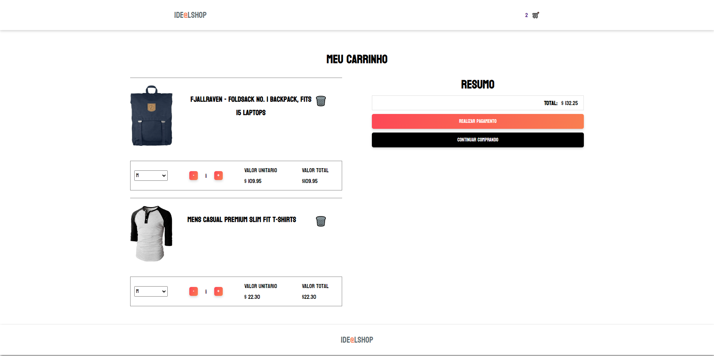

# Desafio  - Ide@l.

# Desafio Prático

### 💻 Sobre o projeto

Desenvolver o Frontend de um e-commerce que consome a API <a href="https://fakestoreapi.com/">Fake Store API</a> e renderiza os produtos na tela. É possivel filtrar por categoria do produto, adicionar e remover 
produtos do carrinho.

### ✅ Demonstração da aplicação
[Clique Aqui](https://anderson-araujo-desafio-03.vercel.app/).

<h3> Mobile </h3>
<details>
  <div style="display: flex;">
   
   
   
 </div>
</details>

<h3> Web </h3>
<details>
  <div style="display: flex;">
   
   
   
 </div>
</details>

#### 🧭 Rodando a aplicação web (Front-end)

```bash

# Clone este repositório
$ git clone git@github.com:andersona16/anderson-desafio-03.git

# Acesse a pasta do projeto no seu terminal/cmd
$ cd anderson-araujo-desafio-03

# Caso queira acessar a aplicação pelo o Visual Studio Code.
$ code .

# Instale as dependências
$ yarn

# Execute a aplicação em modo de desenvolvimento
$ yarn start

# A aplicação será aberta na porta:3000 - acesse http://localhost:3000

```

### 🛠 Tecnologias

As seguintes ferramentas foram usadas na construção do projeto:

- [VueJS](https://vuejs.org/)
- [Vue-Router](https://router.vuejs.org/)
- [Vuex](https://vuex.vuejs.org/)

## 🦸 Autor

[;&link=https://www.linkedin.com/in/andersonaraujjo/>)](https://www.linkedin.com/in/andersonaraujjo/)
[;&link=mailto:andersonaraujoc1@gmail.com>)](mailto:andersonaraujoc1@gmail.com)


